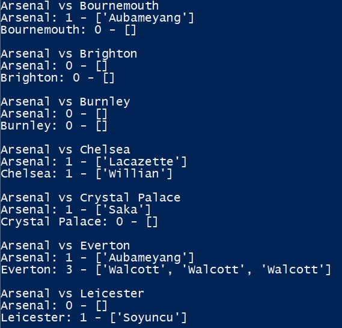
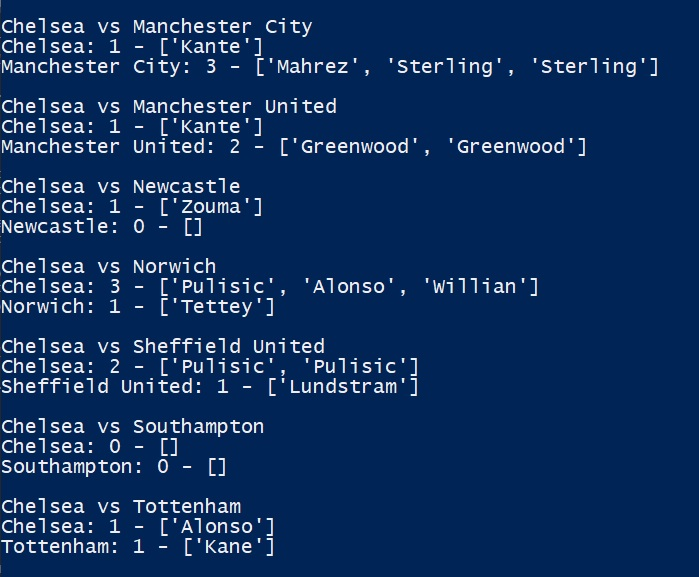
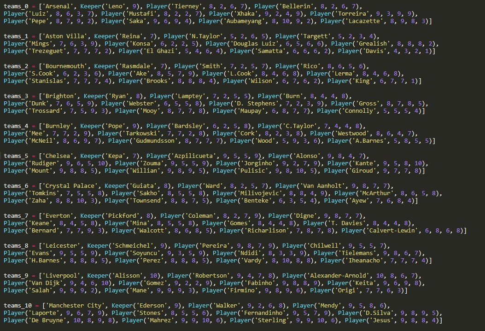
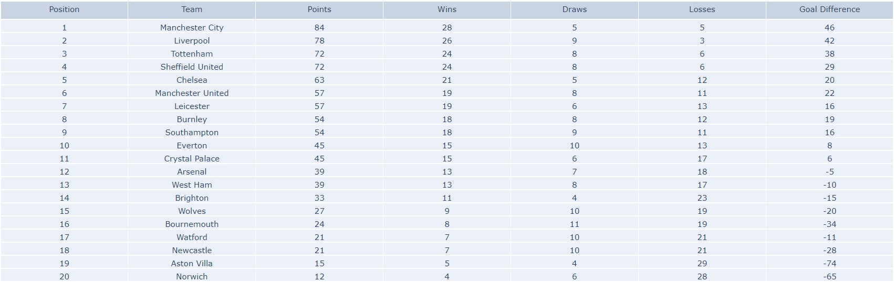
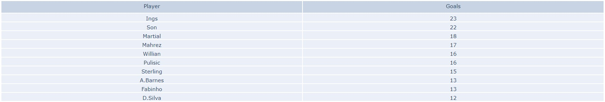
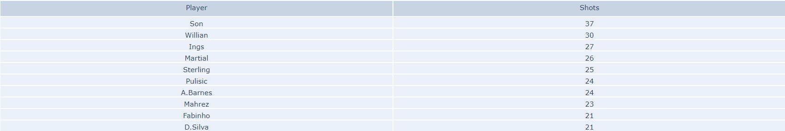
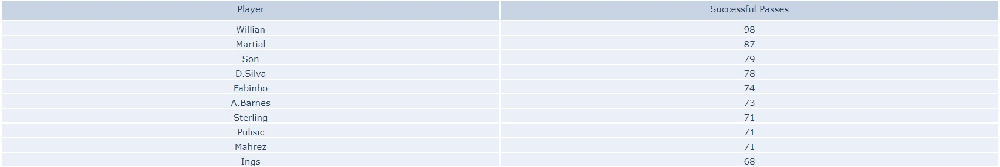
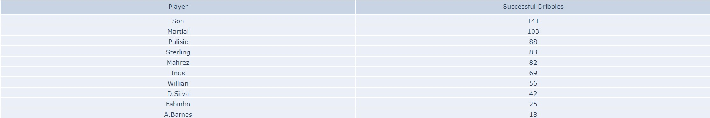

# fm_season
Football match engine. Simulates every game in the current premier league season.

Program runs a simulation through an entire Premier League season with each team playing each other twice.
Program outputs results of each game and goalscorers:

The outcome of the match is determined by the players' attributes for passing/shooting/dribbling/tackling and goalkeeping ability. 
The player data takes in arguments for 'player_name', 'passing', 'shooting', 'dribbling', 'tackling' whilst the goalkeepers take ing arguments for 'player_name', 'ability'.
The player data is shown below.:

Once the season has been completed, the program will offline.plot five .html files to show:

The league table:

Top scorers of the season:

Players with the most shots:

Players with the most passes:

Players with the most dribbles:

