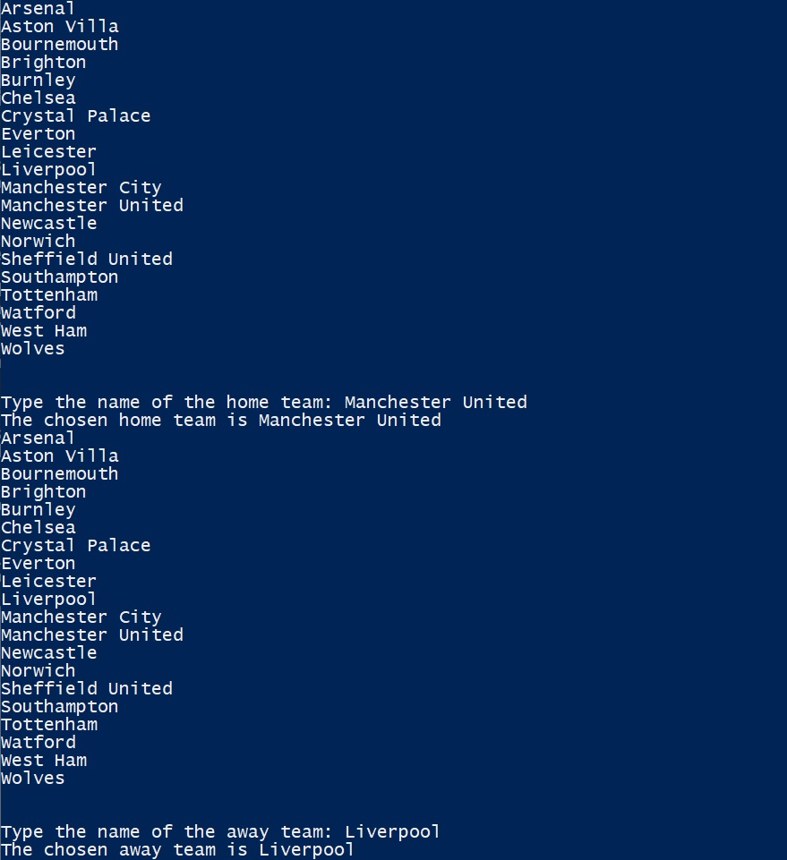
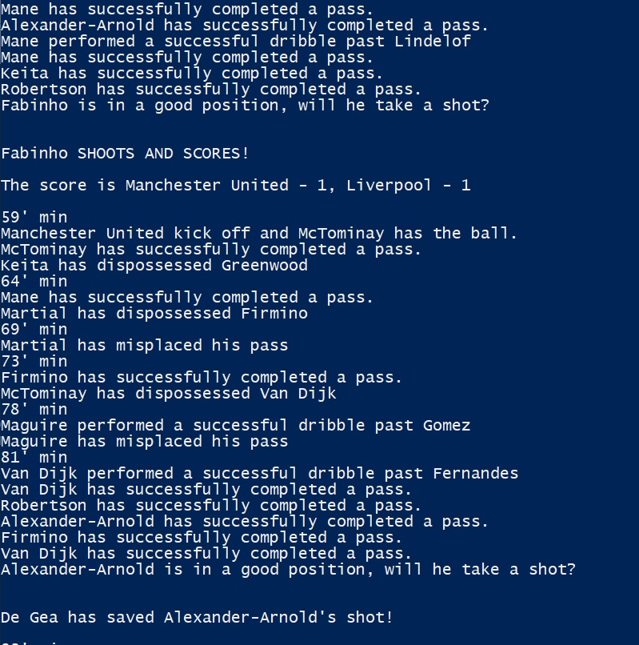
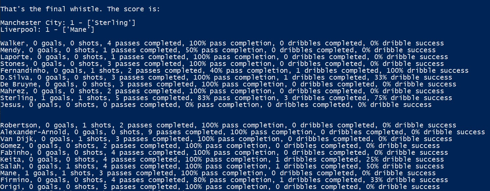

# fm_engine
See season branch for whole season simulator.

Football match engine. Simulates a game between two teams chosen by user.

Program initially prompts user to select two teams to simulate a game:

The outcome of the match is determined by the players' attributes for passing/shooting/dribbling/tackling and goalkeeping ability. 
The player data takes in arguments for 'player_name', 'passing', 'shooting', 'dribbling', 'tackling' whilst the goalkeepers take ing arguments for 'player_name', 'ability'.
The player data is shown below.:

The program will display outcome of passess/dribbles/shots and whether or not it was successful, whilst also updating the players global statistics.
If a goal is scored, the scoreline will update and record the goalscorer

At the end of program, the final score will be printed and output the players final statistics such as:
goals, shots, pass completion, dribbles completion

